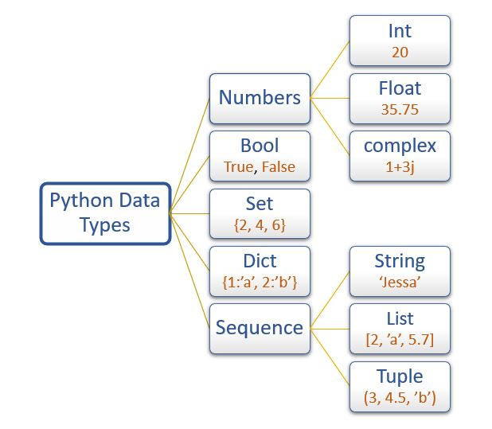

:source-highlighter: rouge
:rouge-style: thankful_eyes
:toc: left
:toclevels: 5
:sectnums:

= Hoofdstuk 3: Gebruik van Variabelen

== Variabelen in Python

Variabelen vormen een kernconcept in programmeren, waardoor softwareontwikkelaars waarden kunnen opslaan en manipuleren voor gebruik in hun programma's. In Python zijn variabelen ##containers voor het opslaan van gegevens## zoals getallen, tekst, lijsten, en meer.

=== Variabelen Toewijzen

Variabelen in Python worden gemaakt door een naam toe te wijzen aan een waarde. Hier is een voorbeeld waarin we de __health__ van een speler in een game bijhouden:

[source,python]
----
# Player health in Counter-Strike
player_health = 100
print("Huidige gezondheid:", player_health)
----

In dit voorbeeld wordt de variabele player_health aangemaakt en toegewezen met de waarde 100. We kunnen de naam van de variabele gebruiken om later de opgeslagen waarde te manipuleren.

=== Naamgeving van Variabelen

In Python is het benoemen van variabelen van groot belang om duidelijke en begrijpelijke code te schrijven. Door een consistente en zinvolle naamgeving te hanteren, maak je niet alleen je code leesbaarder, maar vergemakkelijk je ook het onderhoud en de samenwerking aan projecten. Hier zijn enkele belangrijke regels en tips voor het benoemen van variabelen in Python:

=== Regels voor Naamgeving van Variabelen in Python

* Geldigheid: Variabelen moeten met een letter (a-z, A-Z) of een underscore (_) beginnen. Ze kunnen ook cijfers (0-9) bevatten, maar niet als eerste teken. Bijvoorbeeld: player_score, _health, level1.

* Hoofdlettergevoeligheid: Python is hoofdlettergevoelig, wat betekent dat variabelen met verschillende hoofdletters als verschillende namen worden beschouwd. score en Score zouden bijvoorbeeld twee verschillende variabelen zijn.

* Spaties en Speciale Tekens: Spaties en speciale tekens zoals @, $, en % zijn niet toegestaan in variabelennamen.

* Spaties Vermijden: In plaats van spaties worden underscores vaak gebruikt om woorden in variabelennamen te scheiden, wat de leesbaarheid verbetert. Bijvoorbeeld: player_name, health_points.

* Betekenisvolle Namen: Geef je variabelen namen die hun functie of betekenis in de context aangeven. Een naam als player_health is duidelijker dan een generieke naam zoals x.

== Datatypen en Variabelen

In Python zijn variabelen **niet expliciet getypeerd**, wat betekent dat je geen datatype hoeft op te geven wanneer je een variabele declareert. Python bepaalt automatisch het datatype op basis van de waarde die aan de variabele wordt toegewezen.

Dit maakt van Python een dynamisch getypeerde taal.

Variabelen in Python worden toegewezen met behulp van de toewijzingsoperator (`=`). De operator wijst een waarde toe aan een variabele.

Bijvoorbeeld, om een integer (geheel getal) op te slaan in een variabele genaamd `bullet_damage`, hoef je alleen maar deze toewijzing uit te voeren:

[source,python]
----
bullet_damage = 16
----

In dit geval heeft Python automatisch het datatype van `bullet_damage` ingesteld op een integer met waarde 16.

In bijvoorbeeld Java, moet je het gegevenstype wel expliciet meegegeven:

[source,java]
----
int bullet_damage = 16
----

=== Waarden Bijwerken

Variabelen kunnen op elk moment worden bijgewerkt door er simpelweg een nieuwe waarde aan toe te wijzen. Bijvoorbeeld, als de speler schade oploopt:

[source,python]
----
# Schade oplopen
damage_taken = 25
player_health -= damage_taken
print("Nieuwe gezondheid na geraakt te zijn:", player_health)
----

Hier wordt de variabele damage_taken gemaakt en toegewezen met de waarde 25. Vervolgens verminderen we de gezondheid van de speler door damage_taken van player_health af te trekken.

=== Variabelen en Scope

Variabelen hebben een bepaalde ##"scope" of bereik, wat aangeeft waar de variabele beschikbaar en geldig is##. In Python kunnen variabelen lokaal (binnen een specifieke functie) of globaal (door het hele programma) zijn.

Laten we een voorbeeld bekijken om het concept van scope te illustreren:

[source,python]
----
globale_variabele = 10

# definitie van een functie
def functie():
    lokale_variabele = 5
    print("Lokale variabele, binnen functie:", lokale_variabele)
    print("Globale variabele, binnen functie:", globale_variabele)

# nu voeren we de functie uit
functie()

# En we voeren enkele print statements uit
print("Globale variabele, buiten functie:", globale_variabele)
print("Lokale variabele, buiten functie:", lokale_variabele)
----

Uitvoer:

[source,python]
----
Lokale variabele, binnen functie: 5 <1>
Globale variabele, binnen functie: 10 <2>
Globale variabele, buiten functie: 10 <3>
Traceback (most recent call last): <4>
  File "test.py", line 14, in <module>
    print("Lokale variabele, buiten functie:", lokale_variabele)
NameError: name 'lokale_variabele' is not defined. Did you mean: 'globale_variabele'? <5>
----
<1> De python interpreter zit in de functie, lokale variabele gevonden.
<2> De python interpreter zit in de functie, globale variabele gevonden.
<3> De python interpreter zit buiten de functie, globale variabele gevonden.
<4> De python interpreter zit buiten de functie, lokale variabele NIET gevonden.
<5> Python probeert zelfs een juiste oplossing voor te stellen. Het blijft aan de ontwikkelaar om iets met deze suggestie te doen.

Hier zien we dat de variabele `lokale_variabele` alleen beschikbaar is binnen de functie waarin deze is gedefinieerd. De variabele `globale_variabele` kan zowel binnen als buiten de functie worden gebruikt, omdat deze een globale scope heeft.

== Variabelen en Gegevenstypen

Python heeft verschillende ingebouwde gegevenstypes die je kunt gebruiken om variabelen van verschillende soorten gegevens op te slaan. Enkele van de veelgebruikte datatypen zijn:

- **int:** Gehele getallen, zoals 5, -10, 100.
- **float:** Komma-getallen, zoals 3.14, -0.5, 2.0.
- **str:** Tekst, zoals "Hallo, wereld!", 'Python'.
- **bool:** Booleaanse waarden, True of False.

Bijvoorbeeld:

[source,python]
----
a = 5          # int
b = 3.14       # float
naam = "Alice" # str
waar = True    # bool
----

.De standaard Python gegevenstypen

Gegevenstypes bepalen hoe de computer gegevens opslaat, bewerkt en weergeeft. In een gamingcontext kunnen gegevenstypes worden gebruikt om informatie zoals spelergezondheid, scores, positie en meer vast te leggen. 

Laten we de belangrijkste gegevenstypes eens overlopen:

=== Integer (int)

Het gegevenstype `int` staat voor gehele getallen, zoals 5, -10 en 100. Integer-waarden worden gebruikt voor wiskundige bewerkingen en numerieke berekeningen. Een `int` kan positief, negatief of nul zijn, maar heeft nooit een decimaal deel: zodra een getal een komma (in Python een punt) bevat, zoals `5.0`, is het een `float`.

Bijvoorbeeld:

[source,python]
----
leeftijd = 16
temperatuur = -5
aantal_studenten = 30
----

=== Float (Komma-getal)

Het gegevenstype `float` vertegenwoordigt komma-getallen, ook wel bekend als zwevendekomma-getallen. Dit omvat getallen met decimale punten, zoals 3.14, -0.5 en 2.0. Float-waarden worden gebruikt voor nauwkeurige berekeningen met reële getallen.

Bijvoorbeeld:

[source,python]
----
pi = 3.14159
geldbedrag = 123.45
hoogte = -10.5
----

=== String (str)

Het gegevenstype `str` staat voor tekstuele gegevens, zoals woorden, zinnen of karakters. Tekst in Python wordt omringd door enkele aanhalingstekens (`'`) of dubbele aanhalingstekens (`"`).

Bijvoorbeeld:

[source,python]
----
naam = "Alice"
bericht = 'Hallo, wereld!'
label = "Productcode: 12345"
----

Strings kunnen worden gecombineerd (geconcateneerd) met behulp van de `+` operator:

[source,python]
----
voornaam = "John"
achternaam = "Doe"
volledige_naam = voornaam + " " + achternaam
print(volledige_naam) # Output: John Doe
----

=== Boolean (bool)

Het gegevenstype `bool` vertegenwoordigt booleaanse waarden, namelijk `True` (waar) of `False` (onwaar). Booleaanse waarden worden veel gebruikt in logische bewerkingen en beslissingsstructuren, zoals `if`-voorwaarden.

Bijvoorbeeld:

[source,python]
----
is_student = True
heeft_toegang = False
is_regenachtig = True
----

Booleaanse waarden zijn ook het resultaat van vergelijkingsoperatoren, zoals `==` (gelijk aan), `!=` (niet gelijk aan), `<` (kleiner dan), `>` (groter dan), etc.

Stel je voor dat we een script hebben dat controleert of een speler voldoende gezondheid heeft om een bepaalde taak uit te voeren:

[source,python]
----
player_health = 75
minimum_health_required = 50

is_healthy_enough = player_health > minimum_health_required
print("Is de speler gezond genoeg?", is_healthy_enough)
----

In dit voorbeeld vergelijken we de gezondheid van de speler (player_health) met de vereiste minimale gezondheid (minimum_health_required). Als de gezondheid van de speler groter is dan het minimum, zal is_healthy_enough de waarde True krijgen. Anders zal het de waarde False krijgen.

Booleaanse waarden zijn krachtige hulpmiddelen in games omdat ze de besluitvorming en logica binnen je code mogelijk maken. Je kunt ze gebruiken om te bepalen of een speler een bepaald level heeft bereikt, of een missie is voltooid, of dat bepaalde acties kunnen worden uitgevoerd op basis van bepaalde voorwaarden.

=== Type Opvragen met `type()`

Met de functie `type()` kun je op elk moment opvragen welk datatype een waarde of variabele heeft. Dat is handig om te controleren of Python een waarde begrijpt zoals jij verwacht:

[source,python]
----
print(type(100))      # <class 'int'>
print(type(3.14))     # <class 'float'>
print(type("Alice"))  # <class 'str'>
print(type(True))     # <class 'bool'>
----

=== Type Conversie

Soms is het nodig om gegevens van het ene type naar het andere te converteren. Python biedt hiervoor functies met dezelfde naam als het datatype: `int()`, `float()`, `str()` en `bool()`.

[source,python]
----
leeftijd = 16
leeftijd_als_string = str(leeftijd)   # "16"

score_tekst = "250"
score = int(score_tekst)              # 250

prijs = float("4.99")                 # 4.99
afgerond = int(7.9)                   # 7 (het deel na de komma wordt weggeknipt)
----

TIP: Type conversie heb je vaak nodig in expressies. Je kunt bijvoorbeeld geen tekst en een getal optellen: `"Score: " + 250` geeft een fout. Met `"Score: " + str(250)` werkt het wel.

=== Dynamische Typing

Python staat ook bekend om 'dynamic typed' te zijn, wat betekent dat ##het datatype van een variabele kan veranderen terwijl het programma wordt uitgevoerd##. Dit in tegenstelling tot statisch getypeerde talen zoals Java, waar het datatype vastligt.

Bijvoorbeeld:

[source,python]
----
a = 5        # a is een int
a = "Hallo"  # a is nu een str
a = True     # a is nu een bool
----

Dit houdt een groot risico voor __bugs__ in.

== Expressies

Nu je de vier basisdatatypes kent, wil je er ook mee kunnen rekenen en vergelijken. Daarvoor gebruik je **expressies**.

=== Wat is een Expressie?

**Een expressie** is een stukje code dat Python kan ##uitrekenen (evalueren) tot één waarde##. Een expressie bestaat uit waarden, variabelen en operatoren (zoals `+`, `*` of `>`).

Enkele voorbeelden van expressies:

[source,python]
----
100                  # een waarde op zich is al een expressie
player_health        # een variabele is ook een expressie
player_health - 25   # een berekening
player_health > 50   # een vergelijking
----

Een expressie staat meestal **rechts** van het `=`-teken. Bij een toewijzing gebeuren er twee stappen:

[source,python]
----
damage = 25
health = 100
remaining_health = health - damage
----

. Python evalueert eerst de expressie rechts: `health - damage` wordt `100 - 25`, en dat wordt `75`.
. Daarna wordt het resultaat `75` opgeslagen in de variabele `remaining_health`.

Het onderscheid is dus: ##een variabele is een naam voor een opgeslagen waarde##, ##een expressie is iets wat uitgerekend wordt tot een waarde##. Variabelen kunnen gebruikt worden _in_ expressies, en het resultaat van een expressie kan je opslaan _in_ een variabele.

Elke expressie levert een waarde op van een bepaald datatype. We onderscheiden twee grote soorten:

* **Wiskundige expressies** leveren een getal op (`int` of `float`).
* **Logische expressies** leveren een booleaanse waarde op (`True` of `False`).

=== Wiskundige Expressies

Wiskundige (of rekenkundige) expressies gebruiken **rekenkundige operatoren**:

[cols="1,2,2,1", options="header"]
|===
| Operator | Betekenis | Voorbeeld | Resultaat
| `+` | optellen | `7 + 2` | `9`
| `-` | aftrekken | `7 - 2` | `5`
| `*` | vermenigvuldigen | `7 * 2` | `14`
| `/` | delen | `7 / 2` | `3.5`
| `//` | gehele deling (quotiënt) | `7 // 2` | `3`
| `%` | rest na deling (modulo) | `7 % 2` | `1`
| `**` | machtsverheffing | `7 ** 2` | `49`
|===

Een voorbeeld in een game:

[source,python]
----
kills = 18
deaths = 8
rounds = 24
damage_total = 2150

kd_ratio = kills / deaths             # 2.25
avg_damage = damage_total / rounds    # 89.58333333333333
full_minutes = 250 // 60              # 4 (volledige minuten in 250 seconden)
rest_seconds = 250 % 60               # 10 (overblijvende seconden)
----

==== Het Datatype van het Resultaat

Let goed op welk datatype je terugkrijgt:

* `int` met `int` geeft een `int`: `5 + 3` wordt `8`.
* Zodra er een `float` bij betrokken is, is het resultaat een `float`: `5 + 3.0` wordt `8.0`.
* De deling `/` geeft **altijd** een `float`, ook als de deling "opgaat": `10 / 2` wordt `5.0`.
* Wil je een geheel getal, gebruik dan `//`: `10 // 2` wordt `5`.

==== Volgorde van Bewerkingen

Python volgt dezelfde voorrangsregels als in de wiskunde:

. haakjes `( )`
. machtsverheffing `**`
. vermenigvuldigen en delen: `*`, `/`, `//`, `%`
. optellen en aftrekken: `+`, `-`

[source,python]
----
print(2 + 3 * 4)     # 14, want eerst 3 * 4
print((2 + 3) * 4)   # 20, want eerst de haakjes
----

TIP: Twijfel je over de volgorde? Zet haakjes. Dat maakt je code ook leesbaarder.

==== Verkorte Toewijzing

Vaak wil je een variabele aanpassen op basis van haar eigen waarde. Daarvoor bestaan verkorte schrijfwijzen:

[source,python]
----
score = 100
score = score + 10   # score wordt 110
score += 10          # hetzelfde, korter: score wordt 120
score -= 5           # score wordt 115
score *= 2           # score wordt 230
----

==== Operatoren op Strings

Ook met tekst kun je enkele operatoren gebruiken:

[source,python]
----
voornaam = "John"
achternaam = "Doe"
print(voornaam + " " + achternaam)   # John Doe  (samenvoegen)
print("ha" * 3)                      # hahaha    (herhalen)
----

Tekst en een getal combineren met `+` lukt niet zonder type conversie:

[source,python]
----
kills = 18
print("Kills: " + kills)        # TypeError!
print("Kills: " + str(kills))   # Kills: 18
----

=== Logische Expressies

Een logische expressie levert altijd een `bool` op: `True` of `False`. Je vindt ze terug bij het vergelijken van waarden, en later gebruik je ze als voorwaarde in beslissingsstructuren (hoofdstuk 4) en lussen (hoofdstuk 5).

==== Vergelijkingsoperatoren

[cols="1,2,2,1", options="header"]
|===
| Operator | Betekenis | Voorbeeld | Resultaat
| `==` | is gelijk aan | `5 == 5` | `True`
| `!=` | is niet gelijk aan | `5 != 5` | `False`
| `<` | kleiner dan | `3 < 5` | `True`
| `>` | groter dan | `3 > 5` | `False`
| `\<=` | kleiner dan of gelijk aan | `5 \<= 5` | `True`
| `>=` | groter dan of gelijk aan | `3 >= 5` | `False`
|===

[source,python]
----
player_health = 75
ammo = 0

print(player_health > 50)    # True
print(ammo == 0)             # True
print(player_health != 100)  # True
----

WARNING: Verwar `=` niet met `==`! Eén `=` is een **toewijzing** (sla een waarde op), twee `==` is een **vergelijking** (zijn deze waarden gelijk?).

Je kunt ook strings vergelijken. Let op: Python is hoofdlettergevoelig.

[source,python]
----
print("Alice" == "Alice")   # True
print("Alice" == "alice")   # False
----

==== Logische Operatoren: `and`, `or` en `not`

Met logische operatoren combineer je booleaanse waarden tot één nieuwe booleaanse waarde:

* `and`: is `True` als **beide** kanten `True` zijn.
* `or`: is `True` als **minstens één** kant `True` is.
* `not`: keert de waarde **om**: `not True` wordt `False` en omgekeerd.

Dit kun je samenvatten in een **waarheidstabel**:

[cols="1,1,1,1,1", options="header"]
|===
| `a` | `b` | `a and b` | `a or b` | `not a`
| `True` | `True` | `True` | `True` | `False`
| `True` | `False` | `False` | `True` | `False`
| `False` | `True` | `False` | `True` | `True`
| `False` | `False` | `False` | `False` | `True`
|===

[source,python]
----
player_health = 75
ammo = 12
has_key = False

can_fight = player_health > 50 and ammo > 0   # True and True  -> True
can_open_door = has_key or ammo > 20          # False or False -> False
is_locked = not has_key                        # not False      -> True
----

In hoofdstuk 4 gaan we dieper in op het combineren van voorwaarden met `and`, `or` en `not`.

==== Wiskundige en Logische Expressies Combineren

Wiskundige en logische expressies kun je samen gebruiken. Python rekent eerst de wiskundige delen uit, daarna de vergelijkingen, en pas dan `not`, `and` en `or`:

[source,python]
----
player_health = 60
damage = 25

survives = player_health - damage > 0   # 35 > 0 -> True
is_even = player_health % 2 == 0        # 0 == 0 -> True
----

TIP: De expressie `getal % 2 == 0` is een klassieker: ze controleert of een getal even is.

=== Overzicht: Welk Type Levert een Expressie Op?

[cols="2,1,1", options="header"]
|===
| Expressie | Resultaat | Type
| `8 + 2` | `10` | `int`
| `8 / 2` | `4.0` | `float`
| `8 // 3` | `2` | `int`
| `8 % 3` | `2` | `int`
| `2.5 * 2` | `5.0` | `float`
| `"8" + "2"` | `"82"` | `str`
| `8 > 2` | `True` | `bool`
| `8 == 2 or 8 > 2` | `True` | `bool`
| `not 8 > 2` | `False` | `bool`
|===

== Conclusie

De vier basisdatatypes in Python, `int`, `float`, `str` en `bool`, vormen de bouwstenen van elk programma. Met **wiskundige expressies** reken je met getallen, met **logische expressies** vergelijk en combineer je waarden tot `True` of `False`. Deze expressies heb je nodig in elk volgend hoofdstuk: als voorwaarde in beslissingsstructuren en lussen, en om berekeningen te maken in je programma's.

Meer complexe datatypes zoals lijsten (`list`), tupels (`tuple`) en woordenboeken (`dict`) komen aan bod in hoofdstuk 7.
