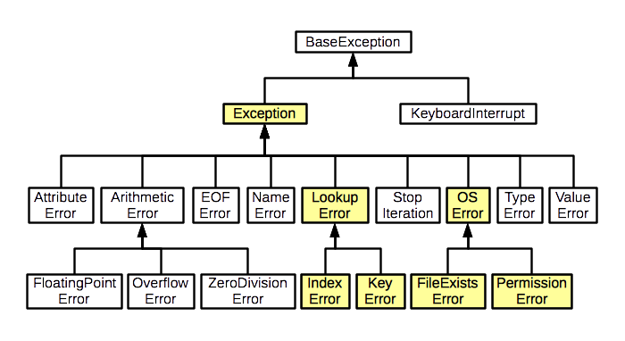

:source-highlighter: rouge
:rouge-style: thankful_eyes
:toc: left
:toclevels: 5
:sectnums:

= Hoofdstuk 9: Exceptions (Uitzonderingen) - Hanteren van fouten

Fouten zijn onvermijdelijk tijdens het schrijven van programma's. 
Python biedt een mechanisme genaamd **exceptions** om met deze fouten om te gaan. 
In dit hoofdstuk zullen we bespreken wat uitzonderingen zijn, hoe ze worden gegenereerd en hoe je ze kunt hanteren.

== Wat zijn Uitzonderingen?

Een __exception__ is een gebeurtenis die optreedt tijdens de uitvoering van een programma en ##die het normale verloop van het programma onderbreekt##. 
Wanneer een fout optreedt, wordt er een __exception__ gegenereerd. Dit kan bijvoorbeeld gebeuren wanneer je probeert te delen door nul, een bestand probeert te openen dat niet bestaat, of probeert toegang te krijgen tot een element dat niet in een lijst staat.

== Het Try-Except Blok

Om met uitzonderingen om te gaan, gebruiken we het `try` en `except` blok. Het idee is om de code die mogelijk een uitzondering genereert binnen het `try` blok te plaatsen. 
Als er een __exception__ optreedt, wordt de bijbehorende `except` blokcode uitgevoerd.

[source,python]
----
try:
    # Code die mogelijk een uitzondering genereert
    leeftijd = int(input("Voer je leeftijd in: "))
except ValueError:
    # Code die wordt uitgevoerd als een ValueError optreedt
    print("Ongeldige invoer voor leeftijd. Voer een getal in.")
----

In dit voorbeeld wordt de `ValueError` __exception__ afgehandeld. Als de gebruiker iets anders dan een getal invoert, zal de `ValueError` worden gegenereerd en wordt de bijbehorende `except` blokcode uitgevoerd.

== Verschillende __exceptions__ behandelen

Je kunt meerdere `except` blokken hebben om verschillende soorten __exceptions__ af te handelen.

[source,python]
----
try:
    num = int(input("Voer een getal in: "))
    resultaat = 10 / num
except ValueError:
    print("Ongeldige invoer. Voer een getal in.")
except ZeroDivisionError:
    print("Je kunt niet door nul delen.")
except Exception as e:
    print(f"Er is een fout opgetreden: {e}")
----

In dit voorbeeld wordt eerst gecontroleerd op een `ValueError`, vervolgens op een `ZeroDivisionError` en tot slot op algemene `Exception`. Het is belangrijk om zo specifiek mogelijk te zijn bij het afhandelen van uitzonderingen.

== Het Finally Blok

Het `finally` blok wordt altijd uitgevoerd, ongeacht of er een __exception__ is opgetreden of niet. Het wordt vaak gebruikt om bronnen vrij te geven, zoals bestanden of netwerkverbindingen.

[source,python]
----
bestand = None
try:
    bestand = open("bestand.txt", "r")
    # Code om met het bestand te werken
except FileNotFoundError:
    print("Het bestand is niet gevonden.")
finally:
    if bestand is not None:
        bestand.close()  # Het bestand wordt altijd gesloten, ook als er later een exception optreedt
----

Merk op dat we eerst `bestand = None` zetten. Als `open()` mislukt, bestaat `bestand` anders niet, en dan zou `bestand.close()` in het `finally` blok zelf een nieuwe fout (`NameError`) veroorzaken.

TIP: Met een `with open(...)`-verklaring (zie hoofdstuk 8) wordt het bestand automatisch gesloten, ook bij een exception. Dat is in de praktijk de eenvoudigste oplossing.

== Hiërarchie van Exceptions
Alle uitzonderingen in Python erven (rechtstreeks of onrechtstreeks) van de basisklasse __BaseException__. Dit is de hoogste klasse in de uitzonderingshiërarchie. Enkele belangrijke uitzonderingsklassen zijn:

* Exception: Basis voor bijna alle ingebouwde uitzonderingen.
* ArithmeticError: Basis voor uitzonderingen die optreden bij wiskundige berekeningen.
* LookupError: Basis voor uitzonderingen die optreden bij ongeldige sleutels of indices.
* FileNotFoundError: Een specifieke uitzondering voor het niet kunnen vinden van een bestand.

[source, python]
----
try:
    # Code die mogelijk een exception kan veroorzaken
    resultaat = deling(x, y)
except ArithmeticError as e:
    # Code die wordt uitgevoerd als er een wiskundige fout optreedt
    print(f"Wiskundige fout: {e}")
except LookupError as e:
    # Code die wordt uitgevoerd als er een fout optreedt bij het zoeken
    print(f"Fout bij opzoeken: {e}")
except Exception as e:
    # Code die wordt uitgevoerd voor alle andere exceptions
    print(f"Andere fout: {e}")
----

=== De Volgorde van `except` Blokken

Python overloopt de `except` blokken ##van boven naar onder## en voert ##enkel het eerste blok uit dat past##. Een `except` voor een bovenliggende klasse vangt ook al haar subklassen op. `except ArithmeticError` vangt dus ook een `ZeroDivisionError` op, en `except Exception` vangt bijna alles op.

Daarom moet je ##specifieke exceptions altijd eerst## zetten, en de algemene pas op het einde.

**Fout:**

[source, python]
----
try:
    resultaat = 10 / 0
except Exception as e:           # vangt ALLES op, ook ZeroDivisionError
    print(f"Algemene fout: {e}")
except ZeroDivisionError:        # wordt NOOIT bereikt
    print("Je kunt niet door nul delen.")
----

**Juist:**

[source, python]
----
try:
    resultaat = 10 / 0
except ZeroDivisionError:        # eerst de specifieke exception
    print("Je kunt niet door nul delen.")
except Exception as e:           # pas op het einde de algemene
    print(f"Algemene fout: {e}")
----

Wil je meerdere exceptions op dezelfde manier afhandelen, dan kun je ze samen in één `except` blok zetten met een tuple:

[source, python]
----
try:
    getal = int(input("Voer een getal in: "))
    resultaat = 10 / getal
except (ValueError, ZeroDivisionError) as e:
    print(f"Ongeldige invoer: {e}")
----

Gebruik `except Exception` met zorg: als je te brede exceptions opvangt, wordt het moeilijker om te begrijpen welke fout er precies is opgetreden.

== Aangepaste __exceptions__

Je kunt ook je eigen __exceptions__ maken voor situaties die specifiek zijn voor je programma.

[source,python]
----
class TeJongError(Exception):
    pass

leeftijd = 15

try:
    if leeftijd < 18:
        raise TeJongError("Je bent te jong voor deze activiteit.")
except TeJongError as e:
    print(e)
----

Hier wordt een aangepaste `TeJongError` gegenereerd en afgehandeld als de leeftijd minder is dan 18.

Het correct omgaan met uitzonderingen is essentieel voor het schrijven van robuuste en fouttolerante programma's. Het stelt je in staat om elegant te reageren op onverwachte omstandigheden en de gebruiker te voorzien van zinvolle foutmeldingen.