:experimental:
:icons: font
:source-highlighter: rouge
:toc: left
:toclevels: 5
:sectnums:

= CSS

CSS staat voor ##Cascading Style Sheets##.
Waar HTML de *inhoud en structuur* van een pagina bepaalt, bepaalt CSS de *vormgeving*: kleuren, lettertypes, afstanden, randen, de plaats van tags op het scherm, ...

Door inhoud (HTML) en vormgeving (CSS) te scheiden:

* kan je met één CSS-bestand de opmaak van een volledige website bepalen;
* pas je de stijl van alle pagina's in één keer aan;
* blijft je HTML kort en overzichtelijk.

In dit hoofdstuk leer je:

* hoe je CSS aan een HTML-pagina koppelt;
* hoe een CSS-regel opgebouwd is;
* hoe je met selectoren de juiste tags kiest;
* kleuren en tekst opmaken;
* tags positioneren met `position`;
* een navigatiebalk en een dropdown-menu maken.

== CSS koppelen aan HTML

Er zijn drie manieren om CSS toe te voegen.

=== Inline

Met het `style`-attribuut op één tag:

[source,html]
----

Deze tekst is rood.

----

Dit werkt, maar is moeilijk te onderhouden: je moet elke tag apart aanpassen.

=== Intern

In een `style`-tag in de `head`:

[source,html]
----
<head>
  
</head>
----

Dit geldt voor één pagina.

=== Extern (aanbevolen)

In een apart bestand, bijvoorbeeld `style.css`, dat je koppelt met een `link`-tag in de `head`:

[source,html]
----
<head>
  <meta charset="UTF-8">
  <title>Mijn website</title>
  <link rel="stylesheet" href="style.css">
</head>
----

.style.css
[source,css]
----
p {
  color: red;
}
----

Alle pagina's die naar `style.css` verwijzen, krijgen dezelfde opmaak. Dit is de manier die je in de rest van de cursus gebruikt.

== De opbouw van een CSS-regel

[source,css]
----
h1 { <1>
  color: navy; <2>
  font-size: 32px; <3>
} <4>
----
<1> De *selector* bepaalt op welke tags de regel van toepassing is: hier alle `h1`-tags.
<2> Een *declaratie* bestaat uit een *eigenschap* (_property_), een dubbelpunt en een *waarde*, afgesloten met een puntkomma.
<3> Je kan zoveel declaraties onder elkaar zetten als je wil.
<4> De accolades omsluiten alle declaraties van de regel.

Commentaar in CSS schrijf je zo:

[source,css]
----
/* Dit is commentaar in CSS */
----

== Selectoren

=== Tag-selector

Selecteert alle tags van een bepaald type.

[source,css]
----
p {
  line-height: 1.5;
}
----

=== Class-selector

Een _class_ geef je in HTML met het `class`-attribuut. In CSS schrijf je een punt voor de naam.
Dezelfde class mag op veel tags staan, en één tag mag meerdere classes hebben.

[source,html]
----

Opgelet: de winkel is gesloten op maandag.

Uitverkoop!

----

[source,css]
----
.waarschuwing {
  color: darkred;
}

.groot {
  font-size: 24px;
}
----

=== ID-selector

Een `id` is *uniek*: hij mag maar één keer voorkomen op een pagina. In CSS schrijf je een hekje voor de naam.

[source,html]
----
<header id="hoofding">...</header>
----

[source,css]
----
#hoofding {
  background-color: black;
}
----

TIP: Gebruik voor opmaak bijna altijd classes. Een `id` gebruik je vooral voor links naar een plaats op de pagina en in JavaScript.

=== Combinaties

[source,css]
----
/* Meerdere selectoren tegelijk (groeperen) */
h1, h2, h3 {
  font-family: Georgia, serif;
}

/* Alle a-tags die ergens in een nav staan */
nav a {
  text-decoration: none;
}

/* Alle p-tags met class intro */
p.intro {
  font-weight: bold;
}
----

Wanneer je twee selectoren combineert om een tag te vinden via zijn plaats ten opzichte van een andere tag, spreken we van een *combinator*:

|===
| Combinator | Voorbeeld | Selecteert

| spatie (_descendant_) | `nav a` | alle `a`-tags *ergens* in een `nav`, ook dieper genest
| `>` (_child_) | `ul > li` | alleen de `li`-tags *rechtstreeks* in een `ul`
| `+` (_adjacent sibling_) | `h2 + p` | de `p`-tag die *direct na* een `h2` komt
| `~` (_general sibling_) | `h2 ~ p` | alle `p`-tags die *ergens na* een `h2` komen, met dezelfde bovenliggende tag
|===

Zo kan je tags opmaken zonder dat ze zelf een `id` of `class` nodig hebben:

[source,html]
----
<table class="scores">
  <tr><th>Naam</th><th>Punten</th></tr>
  <tr><td>Emma</td><td>17</td></tr>
</table>
----

[source,css]
----
.scores th {            /* alle th-tags in de tabel met class scores */
  background-color: navy;
  color: white;
}

.scores td {            /* alle td-tags in die tabel */
  text-shadow: 1px 1px 2px gray;
}
----

=== Pseudo-classes

Een pseudo-class selecteert een tag in een bepaalde *toestand*.

[source,css]
----
a:hover {            /* als de muis over de link gaat */
  color: orange;
}

input:focus {        /* als het invoerveld geselecteerd is */
  border-color: blue;
}

li:first-child {     /* de eerste li-tag */
  font-weight: bold;
}

tr:nth-child(even) { /* elke even rij van een tabel */
  background-color: #f2f2f2;
}
----

== Kleuren

Je kan een kleur op verschillende manieren schrijven:

[source,css]
----
h1 {
  color: tomato;                        /* een kleurnaam */
  color: #ff6347;                       /* hexadecimaal: rood, groen, blauw */
  color: rgb(255, 99, 71);              /* rgb: elk kanaal van 0 tot 255 */
  color: rgba(255, 99, 71, 0.5);        /* met transparantie van 0 tot 1 */
  color: hsl(9, 100%, 64%);             /* tint, verzadiging, lichtheid */
}
----

* `color` bepaalt de kleur van de tekst.
* `background-color` bepaalt de achtergrondkleur.

Een hexadecimale kleur bestaat uit drie paren: `#RRGGBB`. Elk paar gaat van `00` (niets) tot `ff` (maximaal). Dus `#ff0000` is rood, `#000000` is zwart en `#ffffff` is wit.

TIP: In VS Code klik je op het gekleurde vierkantje naast een kleur om een kleurkiezer te openen.

== Tekst

[source,css]
----
body {
  font-family: "Segoe UI", Arial, sans-serif; <1>
  font-size: 16px;
  line-height: 1.6; <2>
  color: #333333;
}

h1 {
  font-weight: bold; <3>
  text-align: center; <4>
  text-transform: uppercase; <5>
  letter-spacing: 2px;
}

a {
  text-decoration: none; <6>
}
----
<1> Een lijst van lettertypes. Is het eerste niet beschikbaar op de computer van de bezoeker, dan wordt het volgende gebruikt. Eindig altijd met een algemene familie: `serif`, `sans-serif` of `monospace`.
<2> De regelafstand: 1.6 keer de lettergrootte.
<3> `normal` of `bold`, of een getal van 100 tot 900.
<4> `left`, `center`, `right` of `justify`.
<5> `uppercase`, `lowercase` of `capitalize`.
<6> Verwijdert de lijn onder links.

=== Google Fonts

Op https://fonts.google.com[fonts.google.com] vind je honderden gratis lettertypes.
Kies een lettertype, klik op _Get font -> Get embed code_ en kopieer de `link`-tags naar je `head`, *voor* je eigen stylesheet:

[source,html]
----
<link rel="preconnect" href="https://fonts.googleapis.com">
<link rel="preconnect" href="https://fonts.gstatic.com" crossorigin>
<link href="https://fonts.googleapis.com/css2?family=Poppins:wght@400;700&display=swap" rel="stylesheet">
<link rel="stylesheet" href="style.css">
----

[source,css]
----
body {
  font-family: "Poppins", sans-serif;
}
----

== Positioneren

Voor elke tag op de pagina beantwoordt de browser twee vragen:

. *Neemt de tag plaats in?* Schuiven de andere tags opzij om plaats voor hem te maken, of gedragen ze zich alsof hij er niet is?
. *Wat is het referentiepunt?* Ten opzichte van wat wordt de tag geplaatst: zijn eigen plaats, een andere tag, of het browservenster?

Met de eigenschap `position` bepaal je het antwoord op die twee vragen.
Als je begrijpt hoe dat werkt, kan je elke positie-opdracht oplossen.

=== De normale flow

Zonder `position` plaatst de browser alle tags in de *normale flow*.
Hij leest de HTML van boven naar onder en zet alle tags volgens deze twee regels:

* blok-tags (`div`, `p`, `h1`, ...) komen *onder* elkaar en nemen de volledige breedte;
* inline tags (`span`, `a`, `strong`, ...) komen *naast* elkaar, in de lopende tekst.

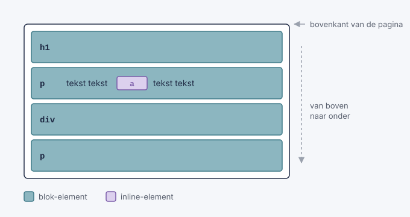

Elke tag *neemt plaats in*: de volgende tag begint pas waar de vorige eindigt.
Is de inhoud langer dan het venster, dan kan je scrollen, en schuift alles in de flow mee.

=== Het coördinatensysteem

Als je een tag verplaatst, gebruik je vier eigenschappen: `top`, `right`, `bottom` en `left`.
Elke eigenschap is een *afstand tussen een rand van het referentiepunt en dezelfde rand van de tag*.

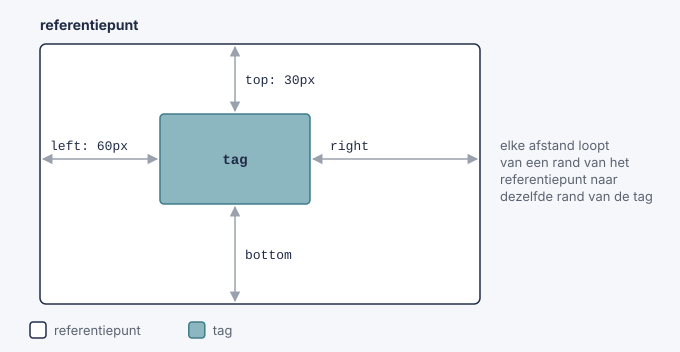

* `top: 30px`: de bovenkant van de tag staat 30px *onder* de bovenkant van het referentiepunt.
* `left: 60px`: de linkerkant van de tag staat 60px van het referentiepunt.
* `right: 0`: de rechterkant van de tag raakt de rechterkant van het referentiepunt.
* Een *negatieve* waarde verschuift in de andere richting: `top: -20px` gaat naar boven.
* Een *percentage* is een percentage van de grootte van het referentiepunt: `left: 50%` is halverwege de breedte.

TIP: Denk aan `top` en `left` als "afstand *van*" en niet als "richting *naar*". `left: 60px` schuift de tag dus naar *rechts*, weg van de linkerkant.

Gebruik meestal één verticale (`top` of `bottom`) en één horizontale eigenschap (`left` of `right`).

In de normale flow (`position: static`) worden deze vier eigenschappen genegeerd.

=== De vijf waarden van position

Elke waarde van `position` is een ander antwoord op de twee vragen van hierboven:

|===
| `position` | Neemt plaats in? | Referentiepunt | Scrolt mee met de pagina?

| `static` (standaard) | ja | geen: de tag staat in de normale flow | ja
| `relative` | ja, op zijn *oorspronkelijke* plaats | zijn eigen oorspronkelijke plaats | ja
| `absolute` | nee | de dichtstbijzijnde bovenliggende tag met een `position` (niet `static`); is die er niet, dan de pagina | ja
| `fixed` | nee | het browservenster | nee
| `sticky` | ja | zijn plaats in de flow, tot hij de rand van het venster raakt | tot hij blijft plakken
|===

==== static: het standaardgedrag

`static` is de *standaardwaarde*: elke tag heeft `position: static`, tenzij je zelf iets anders instelt.
Je hoeft het dus nooit te schrijven. Een tag met `static` staat gewoon in de *normale flow*, precies zoals de browser de HTML van boven naar onder leest:

* blok-tags (`div`, `p`, `h1`, `section`, ...) beginnen op een *nieuwe regel*, komen *onder* elkaar en nemen de *volledige breedte* van de bovenliggende tag;
* inline tags (`span`, `a`, `strong`, `img`, ...) komen *naast* elkaar in de lopende tekst en zijn maar zo breed als hun inhoud. Is de regel vol, dan gaan ze verder op de volgende regel;
* de *volgorde in de HTML* bepaalt de volgorde op het scherm: wat eerst in de HTML staat, staat eerst (bovenaan of links);
* elke tag *neemt plaats in*: tags overlappen elkaar nooit, de volgende tag begint pas waar de vorige eindigt;
* de tag scrolt mee met de rest van de pagina.

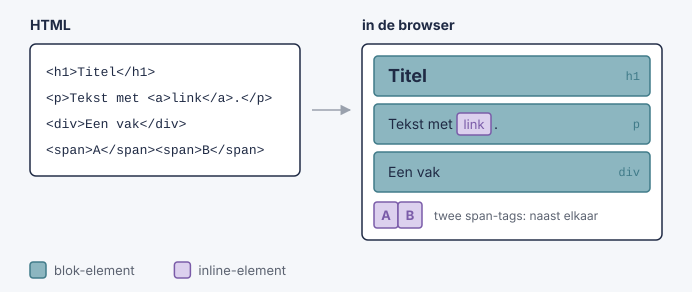

De afstand tussen tags regel je bij `static` dus niet met `top` of `left` (die worden genegeerd), maar met `margin` en `padding`.

[source,css]
----
.vak {
  position: static;   /* mag je weglaten: dit is de standaard */
  top: 50px;          /* heeft GEEN effect bij static */
  margin-top: 50px;   /* dit werkt wel: 50px extra ruimte boven het vak */
}
----

Je schrijft `position: static` alleen als je een andere `position` weer ongedaan wilt maken, bijvoorbeeld in een media query.

TIP: Probeer een opmaak eerst op te lossen met de normale flow (met `margin`, `padding` of Bootstrap). Gebruik pas een andere `position` als dat niet lukt.

Voorbeeld: https://www.w3schools.com/css/tryit.asp?filename=trycss_position_static[`position: static` uitproberen op w3schools^]

==== relative: verschuiven vanaf de eigen plaats

De tag wordt eerst normaal in de flow geplaatst. Daarna wordt hij verschoven, vertrekkend van die plaats.
De andere tags merken daar niets van: zijn *oorspronkelijke plaats blijft bezet*, alsof er een onzichtbare kopie achterblijft.

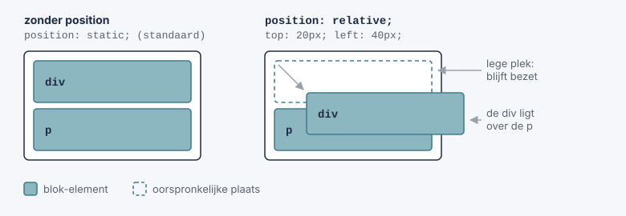

[source,css]
----
.vak {
  position: relative;
  top: 20px;     /* 20px lager dan zijn normale plaats */
  left: 40px;    /* 40px meer naar rechts dan zijn normale plaats */
}
----

`relative` heeft nog een tweede, heel belangrijke rol: de tag wordt het *referentiepunt* voor tags met `position: absolute` die erin zitten (zie hieronder).

Voorbeeld: https://www.w3schools.com/css/tryit.asp?filename=trycss_position_relative[`position: relative` uitproberen op w3schools^]

==== absolute: uit de flow, geplaatst in een referentiepunt

De tag wordt *uit de flow gehaald*. De andere tags schuiven op alsof hij er niet is.
Daarna wordt hij geplaatst ten opzichte van zijn referentiepunt. De browser zoekt dat zo:

. Kijk naar de bovenliggende tag. Heeft die een `position` die niet `static` is? Dan is dat het referentiepunt.
. Zo niet, kijk naar de tag daarboven, enzovoort.
. Vind je er geen, dan is de *pagina* het referentiepunt.

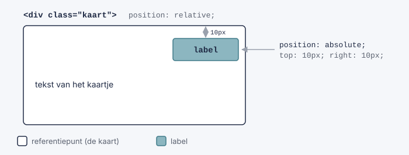

[source,css]
----
.kaart {
  position: relative;   /* maakt van het kaartje het referentiepunt */
}

.kaart .label {
  position: absolute;
  top: 10px;
  right: 10px;          /* rechtsboven in het kaartje */
}
----

Laat je `position: relative` bij `.kaart` weg, dan staat het label rechtsboven in de *pagina*. Het patroon _bovenliggende tag `relative`, tag erin `absolute`_ gebruik je heel vaak.

Heeft een tag met `absolute` geen gepositioneerde bovenliggende tag, dan is de pagina het referentiepunt. Zo plaats je een tag tegen de rand van de pagina:

[source,css]
----
.zijbalk {
  position: absolute;
  top: 0;
  right: 0;       /* tegen de rechterrand van de pagina */
}
----

Voorbeeld: https://www.w3schools.com/css/tryit.asp?filename=trycss_position_absolute[`position: absolute` uitproberen op w3schools^]

==== fixed: vast in het venster

Een tag met `fixed` wordt ook uit de flow gehaald, maar zijn referentiepunt is altijd het *browservenster*.
Omdat het venster niet meescrolt, blijft de tag *op dezelfde plaats op het scherm* staan terwijl de rest van de pagina eronder schuift.
Zo maak je bijvoorbeeld een menu dat altijd zichtbaar blijft of een knop "Terug naar boven".

[source,css]
----
.terug-knop {
  position: fixed;
  bottom: 20px;
  right: 20px;    /* altijd rechtsonder in het venster */
}
----

Voorbeeld: https://www.w3schools.com/css/tryit.asp?filename=trycss_position_fixed[`position: fixed` uitproberen op w3schools^]

==== sticky: eerst normaal, dan vastgeplakt

Een `sticky` tag staat eerst gewoon in de flow en scrolt mee. Zodra hij de afstand bereikt die je opgeeft, blijft hij plakken.

[source,css]
----
nav {
  position: sticky;
  top: 0;    /* plakt vast zodra hij de bovenkant van het venster raakt */
}
----

Voorbeeld: https://www.w3schools.com/css/tryit.asp?filename=trycss_position_sticky[`position: sticky` uitproberen op w3schools^]

=== Een tag centreren met positie

Met wat je nu weet, kan je een tag precies in het midden van zijn referentiepunt zetten. Dat gaat in twee stappen:

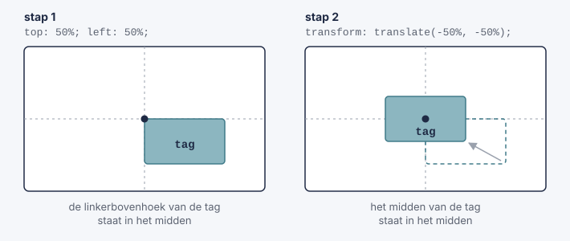

[source,css]
----
.midden {
  position: fixed;                     /* of absolute */
  top: 50%; <1>
  left: 50%;
  transform: translate(-50%, -50%); <2>
}
----
<1> Een percentage bij `top` en `left` is een percentage van het *referentiepunt*. De linkerbovenhoek van de tag komt dus in het midden te staan.
<2> Een percentage bij `translate` is een percentage van de *tag zelf*. De tag schuift de helft van zijn eigen breedte naar links en de helft van zijn eigen hoogte naar boven.

Met `fixed` blijft de tag in het midden van het scherm staan, ook als je scrolt. Met `absolute` staat hij in het midden van zijn referentiepunt.

=== Lagen: z-index

Tags die uit de flow gehaald zijn, kunnen over andere tags heen liggen. Je kan de pagina dus zien als een stapel lagen, met een derde as die naar jou toe wijst.

* Een gepositioneerde tag (niet `static`) ligt boven tags in de normale flow.
* Liggen twee gepositioneerde tags over elkaar, dan ligt de tag die het *laatst* in de HTML staat bovenaan.
* Met `z-index` bepaal je het zelf: een *hoger* getal ligt *bovenaan*.

[source,css]
----
.popup {
  position: fixed;
  z-index: 10;     /* ligt boven .zijbalk */
}

.zijbalk {
  position: absolute;
  z-index: 1;
}
----

`z-index` werkt alleen op tags met een `position` die niet `static` is.

=== Samengevat: welke position kies ik?

Stel jezelf de twee vragen van het begin:

|===
| Wat wil je? | Gebruik

| De tag een beetje verschuiven, zonder dat de rest verandert | `relative`
| De tag op een vaste plaats binnen een andere tag zetten | `absolute`, en `relative` op de bovenliggende tag
| De tag tegen een rand van de pagina zetten | `absolute` zonder gepositioneerde bovenliggende tag
| De tag op het scherm laten staan terwijl je scrolt | `fixed`
| De tag laten meescrollen tot hij bovenaan blijft plakken | `sticky`
| Tags gewoon onder of naast elkaar zetten | geen `position`: laat ze in de normale flow staan
|===

TIP: Gebruik `position` niet om een volledige pagina op te bouwen: laat tags zoveel mogelijk in de normale flow staan. `position` gebruik je voor tags die *bovenop* of *buiten* de normale indeling moeten staan.

== Navigatie

Bijna elke website heeft een *navigatiebalk*: een reeks links naar de andere pagina's van de site.
Een navigatiebalk is eigenlijk gewoon een *lijst met links*. Daarom schrijf je hem in HTML met een `ul` en `li`-tags. Met CSS maak je er daarna een mooie balk van.

[source,html]
----
<nav>
  <ul>
    <li><a class="actief" href="index.html">Home</a></li>
    <li><a href="nieuws.html">Nieuws</a></li>
    <li><a href="contact.html">Contact</a></li>
    <li><a href="over.html">Over ons</a></li>
  </ul>
</nav>
----

TIP: De tag `nav` heeft zelf geen opmaak. Hij vertelt de browser (en bijvoorbeeld een schermlezer voor blinden) dat de links erin de navigatie van de site zijn.

=== Stap 1: de lijst opkuisen

Een `ul` toont standaard bolletjes, en de browser zet er een `margin` en `padding` rond. Voor een navigatiebalk wil je dat niet:

[source,css]
----
nav ul {
  list-style-type: none;  /* geen bolletjes */
  margin: 0;              /* geen ruimte buiten de lijst */
  padding: 0;             /* geen inspringing links */
}
----

Dit is de basis voor *elke* navigatiebalk, verticaal of horizontaal.

=== Verticale navigatiebalk

Bij een verticale navigatiebalk staan de links *onder elkaar*, bijvoorbeeld in een zijbalk.

[source,css]
----
nav ul {
  list-style-type: none;
  margin: 0;
  padding: 0;
  width: 200px;                 /* breedte van de zijbalk */
  background-color: #f1f1f1;
}

nav li a {
  display: block; <1>
  color: black;
  padding: 8px 16px;
  text-decoration: none; <2>
}

nav li a:hover:not(.actief) { <3>
  background-color: #555;
  color: white;
}

nav li a.actief { <4>
  background-color: #04aa6d;
  color: white;
}
----
<1> Een `a`-tag is een inline tag: hij is maar zo breed als zijn tekst. Met `display: block` wordt de *volledige rij* klikbaar en kan je er `padding` en `width` aan geven.
<2> Haalt de onderlijning van de link weg.
<3> Als de muis over een link gaat, verandert de kleur. Met `:not(.actief)` sluit je de actieve link uit.
<4> De class `actief` geef je aan de link van de pagina waar je nu bent. Zo ziet de bezoeker waar hij zich bevindt.

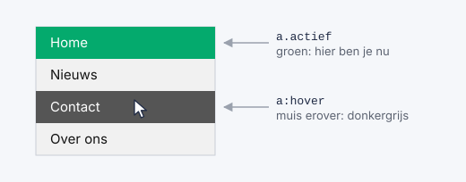

Wil je dat de zijbalk de *volledige hoogte* van het venster inneemt en blijft staan als je scrolt? Combineer dan met wat je over `position` geleerd hebt:

[source,css]
----
nav ul {
  position: fixed;    /* blijft staan als je scrolt */
  height: 100%;       /* volledige hoogte van het venster */
  overflow: auto;     /* scrolbalk als er te veel links zijn */
  width: 200px;
}

main {
  margin-left: 200px; /* anders schuift de inhoud onder de zijbalk */
}
----

Meer voorbeelden: https://www.w3schools.com/css/css_navbar_vertical.asp[verticale navigatiebalken op w3schools^]

=== Horizontale navigatiebalk

Bij een horizontale navigatiebalk staan de links *naast elkaar*, meestal bovenaan de pagina.
`li`-tags zijn blok-tags en komen dus onder elkaar. Er zijn twee manieren om ze naast elkaar te krijgen.

==== Manier 1: inline

De eenvoudigste manier: maak van de `li`-tags inline tags.

[source,css]
----
nav li {
  display: inline;   /* naast elkaar, zoals woorden in een zin */
}
----

Nadeel: inline tags krijgen niet goed een `padding` of `width`. Daarom gebruik je meestal manier 2.

==== Manier 2: float

Met `float: left` schuift elke `li` zo ver mogelijk naar links, naast de vorige.

[source,css]
----
nav ul {
  list-style-type: none;
  margin: 0;
  padding: 0;
  overflow: hidden; <1>
  background-color: #333;
}

nav li {
  float: left; <2>
}

nav li a {
  display: block; <3>
  color: white;
  text-align: center;
  padding: 14px 16px;
  text-decoration: none;
}

nav li a:hover {
  background-color: #111;
}

nav li a.actief {
  background-color: #04aa6d;
}
----
<1> Tags met `float` worden uit de flow gehaald, waardoor de `ul` geen hoogte meer heeft en de achtergrondkleur verdwijnt. Met `overflow: hidden` blijft de `ul` rond de `li`-tags passen.
<2> De `li`-tags komen naast elkaar.
<3> Zoals bij de verticale balk: het hele vak wordt klikbaar en krijgt `padding`.

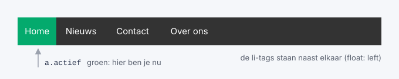

TIP: Wil je één link (bijvoorbeeld "Aanmelden") helemaal rechts? Geef die `li` dan `float: right`.

Ook hier kan je `position` gebruiken: met `position: fixed; top: 0; width: 100%;` blijft de balk bovenaan het venster staan. Met `position: sticky; top: 0;` scrolt hij eerst mee en blijft hij daarna bovenaan plakken.

Meer voorbeelden: https://www.w3schools.com/css/css_navbar_horizontal.asp[horizontale navigatiebalken op w3schools^]

=== Dropdown-menu

Een dropdown-menu is een lijst met links die pas *verschijnt als je met de muis over een knop gaat*.
Je hebt er niets nieuws voor nodig: het is een combinatie van `position`, `display` en de pseudo-class `:hover`.

[source,html]
----

  <button class="dropknop">Vakken</button>
  

    <a href="wiskunde.html">Wiskunde</a>
    <a href="informatica.html">Informatica</a>
    <a href="frans.html">Frans</a>
  

----

[source,css]
----
.dropdown {
  position: relative; <1>
  display: inline-block; <2>
}

.dropknop {
  background-color: #04aa6d;
  color: white;
  padding: 16px;
  font-size: 16px;
  border: none;
}

.dropdown-inhoud {
  display: none; <3>
  position: absolute; <4>
  min-width: 160px;
  background-color: #f9f9f9;
  box-shadow: 0px 8px 16px 0px rgba(0, 0, 0, 0.2); <5>
  z-index: 1; <6>
}

.dropdown-inhoud a {
  display: block;
  color: black;
  padding: 12px 16px;
  text-decoration: none;
}

.dropdown-inhoud a:hover {
  background-color: #ddd;
}

.dropdown:hover .dropdown-inhoud { <7>
  display: block;
}

.dropdown:hover .dropknop {
  background-color: #3e8e41;
}
----
<1> De `.dropdown` wordt het *referentiepunt* voor het menu (dat `absolute` is).
<2> De `.dropdown` is maar zo breed als de knop, en niet de volledige breedte van de pagina.
<3> Het menu is standaard *onzichtbaar*.
<4> Het menu wordt uit de flow gehaald: het duwt de rest van de pagina niet naar beneden, maar ligt erover. Omdat er geen `top` of `left` staat, verschijnt het net onder de knop.
<5> Een schaduw, zodat het menu boven de pagina lijkt te zweven.
<6> Het menu ligt boven de andere tags van de pagina.
<7> Gaat de muis over de `.dropdown` (de knop *of* het menu), dan wordt het menu zichtbaar. Dit is een combinatie van een pseudo-class en een afstammeling-selector.

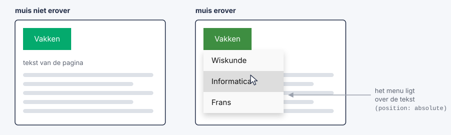

TIP: Wil je het menu rechts uitlijnen onder de knop (handig voor een knop helemaal rechts op de pagina)? Geef `.dropdown-inhoud` dan `right: 0;`.

==== Dropdown in een navigatiebalk

Je kan een dropdown ook in een horizontale navigatiebalk zetten. Je geeft de `li` met het menu de class `dropdown`:

[source,html]
----
<nav>
  <ul>
    <li><a href="index.html">Home</a></li>
    <li><a href="nieuws.html">Nieuws</a></li>
    <li class="dropdown">
      <a href="#" class="dropknop">Vakken</a>
      

        <a href="wiskunde.html">Wiskunde</a>
        <a href="informatica.html">Informatica</a>
        <a href="frans.html">Frans</a>
      

    </li>
  </ul>
</nav>
----

[source,css]
----
nav ul {
  list-style-type: none;
  margin: 0;
  padding: 0;
  background-color: #333;
}

nav li {
  display: inline-block; <1>
}

nav li a {
  display: inline-block;
  color: white;
  padding: 14px 16px;
  text-decoration: none;
}

nav li a:hover,
.dropdown:hover .dropknop {
  background-color: red;
}

.dropdown-inhoud {
  display: none;
  position: absolute;
  min-width: 160px;
  background-color: #f9f9f9;
  box-shadow: 0px 8px 16px 0px rgba(0, 0, 0, 0.2);
  z-index: 1;
}

.dropdown-inhoud a {
  display: block; <2>
  color: black;
}

.dropdown-inhoud a:hover {
  background-color: #f1f1f1;
}

.dropdown:hover .dropdown-inhoud {
  display: block;
}
----
<1> Hier gebruiken we `inline-block` in plaats van `float`: de `li`-tags staan naast elkaar én kunnen `padding` krijgen. Met `overflow: hidden` (nodig bij `float`) zou het menu afgeknipt worden.
<2> De links in het menu staan wél onder elkaar.

Meer voorbeelden: https://www.w3schools.com/css/css_dropdowns.asp[dropdowns op w3schools^]

TIP: In Bootstrap (zie verder) zijn navigatiebalken en dropdowns kant-en-klaar. Toch is het nuttig om te weten hoe ze werken: dan kan je ze ook aanpassen.

== Transities

Bij <<_navigatie,Navigatie>> maakte je een navigatiebalk waarvan de links van kleur veranderen als je er met de muis over gaat, en een dropdown-menu dat verschijnt.
Die veranderingen gebeuren *in één klap*: de ene kleur springt meteen naar de andere.

Met een ##transitie## laat je zo'n verandering *geleidelijk* gebeuren, over een tijd die je zelf kiest. De kleur vloeit dan rustig over naar de nieuwe kleur, een knop groeit langzaam, een menu schuift zachtjes open.

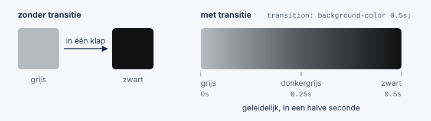

In dit deel leer je:

* wat een transitie is en wanneer ze start;
* hoe lang een transitie duurt (`transition-duration`);
* welke eigenschappen je laat veranderen (`transition-property`);
* hoe de snelheid verloopt (`transition-timing-function`);
* hoe je een transitie later laat starten (`transition-delay`);
* tags verplaatsen, vergroten en draaien met `transform`;
* transities toepassen op je navigatiebalk en dropdown-menu.

Meer uitleg en voorbeelden: https://www.w3schools.com/css/css3_transitions.asp[CSS-transities op w3schools^]

=== Je eerste transitie

Een transitie heeft altijd twee dingen nodig:

. de *eigenschap* die moet veranderen, bijvoorbeeld `width` of `background-color`;
. de *duur* van de verandering, in seconden (`s`) of milliseconden (`ms`).

[source,html]
----

Ga met je muis over mij

----

[source,css]
----
.vak {
  width: 100px;
  height: 100px;
  background-color: tomato;
  transition: width 2s; <1>
}

.vak:hover {
  width: 300px; <2>
}
----
<1> Als `width` verandert, gebeurt dat geleidelijk, over 2 seconden.
<2> Gaat de muis over het vak, dan wordt het 300px breed.

Gaat de muis over het vak, dan groeit het in twee seconden van 100px naar 300px. Haal je de muis weg, dan krimpt het in twee seconden terug.

IMPORTANT: Zet de `transition` op de *gewone* selector (`.vak`), niet op `.vak:hover`. Zo werkt de transitie in de twee richtingen: bij het erover gaan én bij het weggaan. Staat ze alleen bij `:hover`, dan springt het vak bij het weggaan in één klap terug.

Een transitie *start* altijd wanneer een eigenschap een andere waarde krijgt. Meestal gebeurt dat met een pseudo-class zoals `:hover` of `:focus`. Later, met JavaScript, kan je ook een class toevoegen of weghalen.

TIP: Vergeet je de duur, dan is die `0s` en zie je dus geen transitie.

Voorbeeld: https://www.w3schools.com/css/tryit.asp?filename=trycss3_transition1[een eerste transitie uitproberen op w3schools^]

=== Meerdere eigenschappen tegelijk

Wil je meer dan één eigenschap geleidelijk laten veranderen? Zet ze dan na elkaar, gescheiden door een *komma*. Elke eigenschap kan een eigen duur krijgen.

[source,css]
----
.vak {
  width: 100px;
  height: 100px;
  background-color: tomato;
  transition: width 2s, height 4s, background-color 1s;
}

.vak:hover {
  width: 300px;
  height: 300px;
  background-color: royalblue;
}
----

Hier wordt het vak in 2 seconden breder, in 4 seconden hoger en in 1 seconde blauw.

Wil je *alle* eigenschappen die veranderen dezelfde transitie geven? Gebruik dan `all`:

[source,css]
----
.vak {
  transition: all 0.5s;
}
----

TIP: `all` is handig, maar soms laat het dingen bewegen die je niet verwacht. Schrijf je de eigenschappen zelf uit, dan houd je beter de controle.

Niet elke eigenschap kan geleidelijk veranderen. Alles met een *getal* (`width`, `height`, `margin`, `padding`, `top`, `left`, `font-size`, `opacity`, ...) of een *kleur* (`color`, `background-color`, `border-color`, ...) kan dat wel. Een eigenschap zoals `display` (van `none` naar `block`) of `font-family` kan dat niet: daar bestaat geen tussenstap, dus die springt meteen.

=== Het verloop van de snelheid: transition-timing-function

Een transitie hoeft niet aan één gelijke snelheid te gebeuren. Met `transition-timing-function` kies je hoe de snelheid verloopt:

|===
| Waarde | Verloop

| `ease` (standaard) | traag beginnen, dan snel, dan traag eindigen
| `linear` | van begin tot einde dezelfde snelheid
| `ease-in` | traag beginnen, snel eindigen
| `ease-out` | snel beginnen, traag eindigen
| `ease-in-out` | traag beginnen en traag eindigen
| `cubic-bezier(n,n,n,n)` | een eigen verloop, met vier getallen tussen 0 en 1
|===

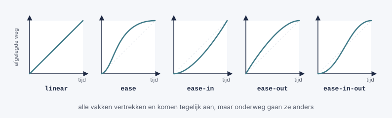

[source,css]
----
#vak1 { transition: width 2s; transition-timing-function: linear; }
#vak2 { transition: width 2s; transition-timing-function: ease; }
#vak3 { transition: width 2s; transition-timing-function: ease-in; }
#vak4 { transition: width 2s; transition-timing-function: ease-out; }
#vak5 { transition: width 2s; transition-timing-function: ease-in-out; }
----

Zet je vijf zulke vakken onder elkaar en ga je er met de muis over, dan zie je goed het verschil: ze vertrekken en komen allemaal tegelijk aan, maar onderweg gaan ze anders.

TIP: Voor de meeste effecten op een website (knoppen, menu's) voelen `ease` en `ease-out` het meest natuurlijk aan. Met `linear` lijkt een beweging al snel mechanisch.

Voorbeeld: https://www.w3schools.com/css/tryit.asp?filename=trycss3_transition_speed[de verschillende snelheden vergelijken op w3schools^]

=== Later starten: transition-delay

Met `transition-delay` wacht de browser eerst een tijdje voor de transitie begint.

[source,css]
----
.vak {
  width: 100px;
  transition: width 3s;
  transition-delay: 1s;   /* wacht 1 seconde, en groei dan in 3 seconden */
}

.vak:hover {
  width: 300px;
}
----

Een vertraging is handig bij een dropdown-menu: zo klapt het niet meteen dicht als je muis per ongeluk even naast het menu komt (zie verder).

Voorbeeld: https://www.w3schools.com/css/tryit.asp?filename=trycss3_transition_delay[`transition-delay` uitproberen op w3schools^]

=== De vier eigenschappen samengevat

Een transitie bestaat uit vier eigenschappen:

|===
| Eigenschap | Betekenis | Standaardwaarde

| `transition-property` | welke eigenschap(pen) geleidelijk veranderen | `all`
| `transition-duration` | hoe lang de verandering duurt | `0s`
| `transition-timing-function` | hoe de snelheid verloopt | `ease`
| `transition-delay` | hoe lang de browser wacht voor hij begint | `0s`
|===

Je kan ze apart schrijven:

[source,css]
----
.vak {
  transition-property: width;
  transition-duration: 2s;
  transition-timing-function: linear;
  transition-delay: 1s;
}
----

Maar meestal schrijf je ze samen in één regel met de verkorte eigenschap `transition`, in deze volgorde:

[source,css]
----
.vak {
  transition: width 2s linear 1s;
  /*          |     |  |      |
              |     |  |      +-- delay
              |     |  +--------- timing-function
              |     +------------ duration
              +------------------ property          */
}
----

Je moet niet alles invullen: wat je weglaat, krijgt de standaardwaarde. `transition: width 2s;` is dus hetzelfde als `transition: width 2s ease 0s;`.

NOTE: Staan er twee tijden in de regel, dan is de *eerste* altijd de duur en de *tweede* de vertraging.

=== Transitie en transform

Een transitie wordt pas echt leuk in combinatie met `transform`. Met `transform` kan je een tag *verplaatsen*, *vergroten* of *draaien*, zonder dat de andere tags opschuiven: net zoals bij `position: relative` blijft de oorspronkelijke plaats bezet.

|===
| Functie | Wat doet ze? | Voorbeeld

| `translate(x, y)` | verschuift de tag | `transform: translate(20px, -10px);`
| `scale(n)` | vergroot of verkleint de tag (`1` = normaal, `1.5` = anderhalf keer zo groot) | `transform: scale(1.1);`
| `rotate(hoek)` | draait de tag, in graden (`deg`) | `transform: rotate(45deg);`
|===

Je kan ze ook combineren, gescheiden door een spatie: `transform: scale(1.2) rotate(10deg);`.

`translate` ken je al van <<_een_tag_centreren_met_positie,Een tag centreren met positie>>: daar gebruikte je `transform: translate(-50%, -50%)` om een tag te centreren.

[source,css]
----
.vak {
  width: 100px;
  height: 100px;
  background-color: tomato;
  transition: width 2s, height 2s, transform 2s;
}

.vak:hover {
  width: 300px;
  height: 300px;
  transform: rotate(180deg);   /* draait een halve toer terwijl hij groeit */
}
----

Een bekend effect is een knop die een klein beetje groeit en omhoog komt als je erover gaat:

[source,css]
----
.knop {
  background-color: #04aa6d;
  color: white;
  padding: 12px 24px;
  border: none;
  border-radius: 6px;
  transition: transform 0.2s ease-out, box-shadow 0.2s ease-out;
}

.knop:hover {
  transform: translateY(-3px) scale(1.05);       /* 3px omhoog en iets groter */
  box-shadow: 0px 6px 12px rgba(0, 0, 0, 0.3);   /* schaduw: de knop lijkt te zweven */
}
----

TIP: Wil je iets laten bewegen, gebruik dan liever `transform` dan `width`, `top` of `margin`. Bij `transform` moet de browser de rest van de pagina niet opnieuw schikken, waardoor de beweging vlotter verloopt.

Voorbeeld: https://www.w3schools.com/css/tryit.asp?filename=trycss3_transition_transform[transitie met transform uitproberen op w3schools^]

=== Transities in je navigatiebalk

Nu kan je de navigatiebalk van hierboven afwerken. We vertrekken van de horizontale navigatiebalk:

[source,html]
----
<nav>
  <ul>
    <li><a class="actief" href="index.html">Home</a></li>
    <li><a href="nieuws.html">Nieuws</a></li>
    <li class="dropdown">
      <a href="#" class="dropknop">Vakken</a>
      

        <a href="wiskunde.html">Wiskunde</a>
        <a href="informatica.html">Informatica</a>
        <a href="frans.html">Frans</a>
      

    </li>
  </ul>
</nav>
----

==== Een zachte hoverkleur

De eenvoudigste verbetering: laat de achtergrondkleur van de links geleidelijk veranderen.

[source,css]
----
nav li a {
  display: inline-block;
  color: white;
  padding: 14px 16px;
  text-decoration: none;
  transition: background-color 0.3s; <1>
}

nav li a:hover {
  background-color: #111;
}
----
<1> Eén regel extra, en de kleur vloeit voortaan in 0,3 seconden over.

TIP: Houd transities in een menu kort: tussen `0.2s` en `0.4s`. Duurt het langer, dan lijkt je website traag.

==== Een streep die onder de link groeit

Een mooi effect is een streep die onder de link verschijnt en van links naar rechts groeit. Daarvoor gebruik je `::after`: daarmee voeg je met CSS een extra (lege) tag toe *in* de link, na de tekst.

[source,css]
----
nav li a {
  position: relative; <1>
}

nav li a::after {
  content: ""; <2>
  position: absolute; <3>
  left: 0;
  bottom: 0;
  width: 0; <4>
  height: 3px;
  background-color: #04aa6d;
  transition: width 0.3s ease-out;
}

nav li a:hover::after {
  width: 100%; <5>
}
----
<1> De link wordt het referentiepunt voor de streep.
<2> Zonder `content` toont de browser `::after` niet. Hier is de inhoud leeg: we willen alleen een gekleurd vak.
<3> De streep wordt uit de flow gehaald en onderaan in de link gezet.
<4> In het begin is de streep 0px breed, dus onzichtbaar.
<5> Gaat de muis over de link, dan groeit de streep tot de volledige breedte van de link.

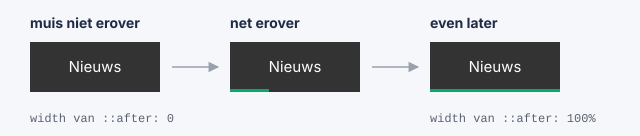

==== Een dropdown die zacht verschijnt

Bij het <<_dropdown_menu,dropdown-menu>> maakte je het menu zichtbaar met `display: none` en `display: block`. Maar `display` kan geen transitie krijgen: het menu springt dus altijd in één keer open.

De oplossing: laat het menu altijd `display: block` en verberg het op een andere manier, met eigenschappen die *wel* geleidelijk kunnen veranderen:

* `opacity`: de doorzichtigheid, van `0` (volledig doorzichtig) tot `1` (volledig zichtbaar);
* `visibility`: `hidden` of `visible`. Een tag met `visibility: hidden` is onzichtbaar *en* je kan er niet op klikken. Bij `opacity: 0` alleen zou je nog op de onzichtbare links kunnen klikken.

[source,css]
----
.dropdown-inhoud {
  display: block;                   /* niet meer none */
  position: absolute;
  min-width: 160px;
  background-color: #f9f9f9;
  box-shadow: 0px 8px 16px 0px rgba(0, 0, 0, 0.2);
  z-index: 1;

  opacity: 0; <1>
  visibility: hidden;
  transform: translateY(-10px); <2>
  transition: opacity 0.3s, transform 0.3s, visibility 0.3s;
}

.dropdown:hover .dropdown-inhoud {
  opacity: 1; <3>
  visibility: visible;
  transform: translateY(0);
}
----
<1> In het begin is het menu doorzichtig en onzichtbaar.
<2> Het menu staat ook 10px te hoog.
<3> Gaat de muis over de `.dropdown`, dan wordt het menu zichtbaar en schuift het naar zijn plaats: het lijkt zachtjes naar beneden te glijden.

TIP: Wil je dat het menu niet meteen dichtklapt als je muis even van het menu glijdt? Geef het dichtklappen dan een kleine vertraging. Zet `transition-delay: 0.2s;` bij `.dropdown-inhoud` en `transition-delay: 0s;` bij `.dropdown:hover .dropdown-inhoud`. Zo opent het menu meteen, maar sluit het pas na 0,2 seconden.

=== Rekening houden met de bezoeker

Sommige mensen worden misselijk of duizelig van bewegingen op een scherm. Zij kunnen in de instellingen van hun computer of smartphone aangeven dat ze *minder beweging* willen. Met een media query kan je daar rekening mee houden:

[source,css]
----
@media (prefers-reduced-motion: reduce) {
  * {
    transition: none !important;   /* alle transities uitschakelen */
  }
}
----

Gebruik transities altijd om je website *duidelijker* te maken (de bezoeker ziet wat er verandert), niet om zoveel mogelijk te laten bewegen.

=== Transities samengevat

* Een transitie laat een verandering van een eigenschap *geleidelijk* gebeuren.
* Je zet de `transition` op de gewone selector, en laat de eigenschap veranderen met bijvoorbeeld `:hover`.
* Je hebt minstens een *eigenschap* en een *duur* nodig: `transition: background-color 0.3s;`.
* Meerdere eigenschappen scheid je met een komma, of je gebruikt `all`.
* Met `transition-timing-function` kies je het verloop van de snelheid, met `transition-delay` een vertraging.
* Alleen eigenschappen met een getal of een kleur kunnen geleidelijk veranderen. `display` niet: gebruik daarvoor `opacity` en `visibility`.
* Met `transform` (`translate`, `scale`, `rotate`) maak je vlotte bewegingen.

|===
| Wat wil je? | CSS

| Een kleur zacht laten veranderen | `transition: background-color 0.3s;`
| Een knop laten groeien | `transition: transform 0.2s;` en bij `:hover`: `transform: scale(1.1);`
| Een menu zacht laten verschijnen | `opacity` en `visibility` met een transitie, in plaats van `display`
| Alles laten veranderen met dezelfde snelheid | `transition: all 0.5s;`
| Een transitie later laten starten | `transition-delay: 1s;`
|===

Wil je meer weten? Op w3schools vind je ook het volgende onderwerp: https://www.w3schools.com/css/css3_animations.asp[CSS-animaties^]. Daarmee laat je iets bewegen zonder dat de bezoeker iets moet doen, en met meer dan twee stappen.

== Fouten opsporen

Open de ontwikkelaarstools (kbd:[F12]) en selecteer een tag. Rechts zie je:

* welke CSS-regels van toepassing zijn, en welke doorstreept zijn omdat een andere regel wint;
* hoeveel ruimte er binnen de rand (`padding`) en buiten de rand (`margin`) van de tag is.

Je kan er waarden aanpassen en meteen het resultaat zien. Let op: die aanpassingen worden niet opgeslagen. Neem ze daarna over in je CSS-bestand.

Veelgemaakte fouten:

* een puntkomma of accolade vergeten;
* het punt (`.`) vergeten voor een class-selector;
* een verkeerd pad in de `link`-tag;
* een spatie tussen getal en eenheid: `20 px` werkt niet, `20px` wel.